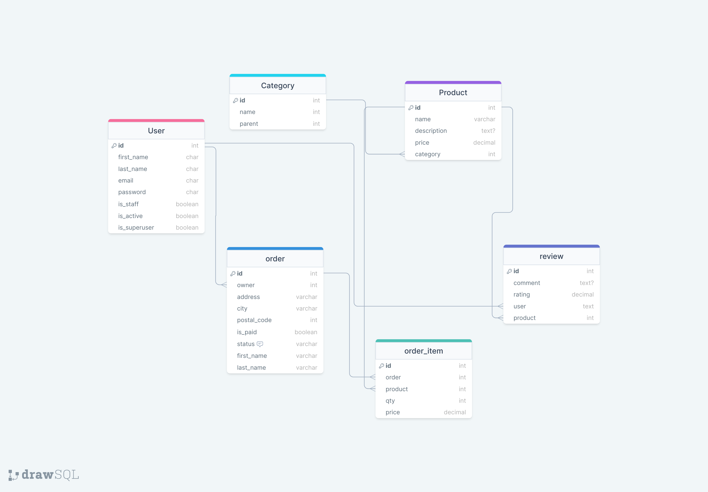

# Ecommerce API Documentation

This documentation provides an overview of the Ecommerce API built using Django Rest Framework. The API is designed to support various e-commerce operations, including product management, order processing, user authentication, and more.

## Database Schema



## Table of Contents

- [Authentication](#authentication)
- [Users](#users)
- [Products](#products)
- [Orders](#orders)
- [Payments](#payments)
- [Categories](#categories)
- [Reviews](#reviews)

## Authentication

The Ecommerce API uses token-based authentication. To access protected endpoints, clients need to include a valid token in the `Authorization` header of their requests.

### Registration

**Endpoint:** `POST /api/auth/register/`

Register a new user by providing their email, username, and password.

Request:

```json
{
  "email": "user@example.com",
  "first_name": "exampleFirstName",
  "last_name": "exampleLastName",
  "password": "password123"
}
```

Response:

```json
{
  "email": "user@example.com",
  "first_name": "exampleFirstName",
  "last_name": "exampleLastName",
  "id": 1
}
```

### Login

**Endpoint:** `POST /api/auth/login/`

logs a user in by providing their email and password. Upon login success, the API will return an access token and user details.

Request:

```json
{
  "email": "user@example.com",
  "password": "password123"
}
```

Response:

```json
{
  "access_token": "ciOiJIUzI1NiIsInR5cCI6IkpXVCJ9.eyJ1c2VyX2lkIjoxLCJlbWFpbCI6Im",
  "user": {
    "email": "user@example.com",
    "first_name": "exampleFirstName",
    "last_name": "exampleLastName",
    "id": "2"
  }
}
```

### Change Password

This documentation provides a step-by-step guide for changing your password, ensuring the security of your account. The process consists of three main steps:

1. **Request Password Reset**: In this step, you initiate a password reset request.
2. **Verify OTP**: After requesting a reset, you will receive a password reset link.
3. **Set a New Password**: Once verified, you can set a new password for your account.

#### Step 1: Request Password Reset

##### 1.1 Initiate Password Reset Request

To begin the password reset process, you must initiate a request. This typically involves navigating to the "Forgot Password" or "Reset Password" option on the login page.

Request:

```json
POST /api/auth/password-reset-request
{
    "email": "user@example.com"
}
```

##### 1.2 Receive Reset Link

After initiating the request, you will receive an email containing a link to reset password.

Subject: Password Reset Link
Body: Your password reset Link is: 123456
